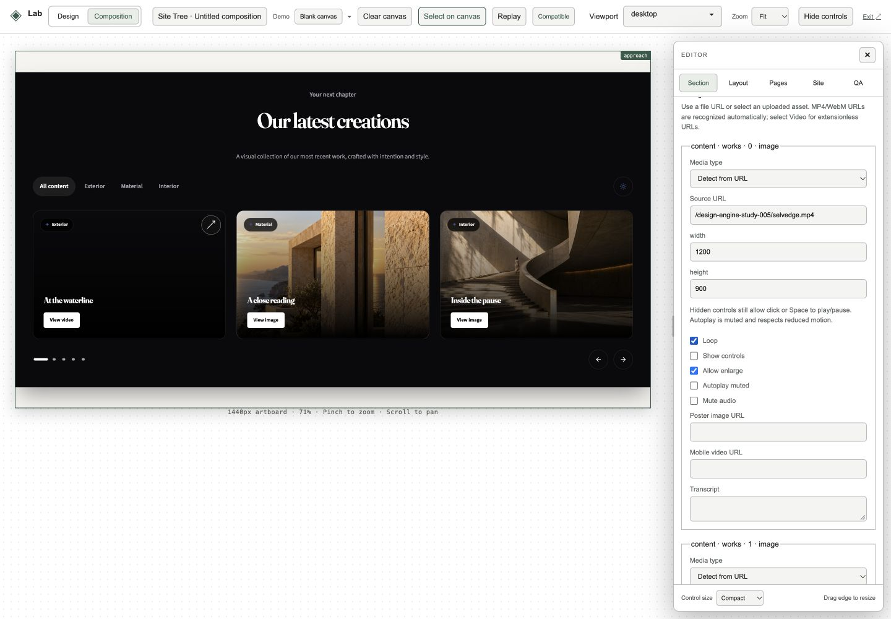
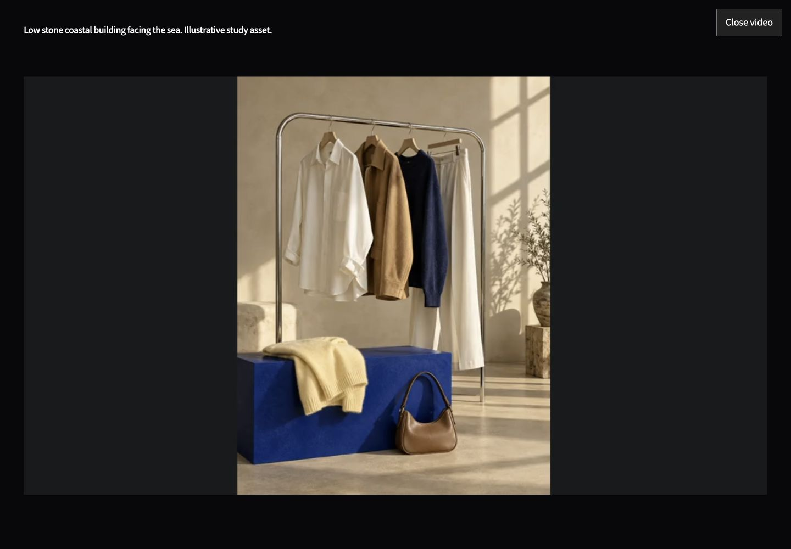
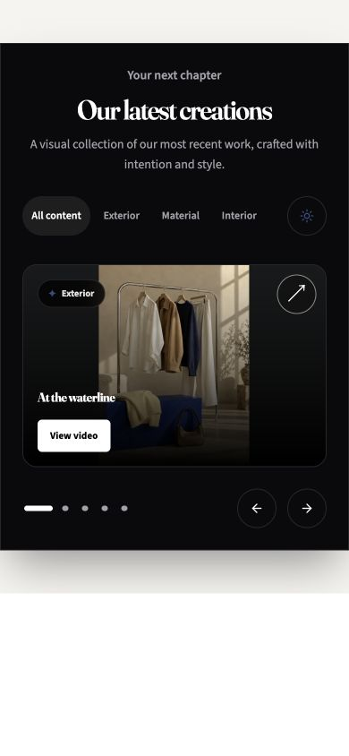
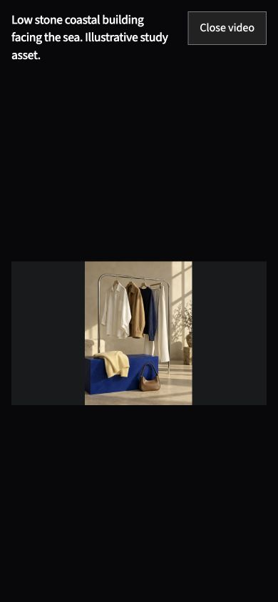

# Video inputs and section widths

Existing production image slots now deliver images or native video from the same saved media record. This includes heroes, work galleries, services, product media, evidence portraits, and navigation brand media. Static image delivery keeps its responsive markup, focal positions and original styles. Selection thumbnails and brand links use noninteractive video previews; the selected/full media view supplies playback and inspection.

## Authoring

Open `/admin/lab?workspace=composition`, select a section, and open **Images and videos**. Paste a direct MP4/WebM file URL or select Video for an extensionless URL. The existing project asset picker also accepts uploaded videos in image source slots.

Video options: Loop, Show controls, Allow enlarge, Autoplay muted, Mute audio, poster image, mobile video source, and transcript. Hidden controls allow click, Enter or Space to play/pause. Enlargement preserves the playhead and uses a native modal with Escape and focus restoration. Playback pauses offscreen and while the document is hidden. Authored autoplay is muted and respects reduced motion. Existing caption-track validation remains intact; caption records remain available in the strict content editor.

**Section width** offers Original / contained, Full width · keep gutters, and Edge to edge · no gutters. The choice is saved on each section as `sectionWidth`, independently of structural `layout` settings. Width uses the host artboard so previews and exported websites agree, including a page that reserves space for a navigation rail. Reading columns keep their intended text measures. Design Lab also exposes Section width for component previews.

The Liquid Glass Carousel retains its original shader for photo-only collections. Collections containing video use a native horizontal media rail with playable video and enlarge controls. Native video is not passed to an image texture loader.

## Components

Added shared `MediaAsset`, `VideoPlayer`, `SectionVideoPlayer`, and editor `MediaControls`. Updated `ImageExpansionSlider`, `ImageGallery`, `AppleCardCarousel` delivery through its shared Plate, and `LiquidGlassCarousel`, plus shared production media leaves. Existing gallery registry names remain unchanged.

## Validation

- Strict media/width audits cover all 98 registered sections, plus URL detection, caption rules and saved site round trips: 199 new assertions.
- Clean release checkout: 75 test files, 1,568 tests passed; lint, typecheck and production build passed.
- Browser checks at 1440×1000 and 390×844: keyboard play/pause with hidden controls; loop playback; offscreen pause/resume; enlargement and Escape/focus restoration; hero, gallery, service, proof and commerce native delivery; editor save/reload.
- Hover gallery visual width at a 1440px artboard: original 1024px, full with gutters 1324.8125px, edge 1440px. No page overflow in those checks.
- Verified all 27 pinned runtime file hashes. See `evidence/validation.json` for the built version.

The release contains only this media and width scope. Unrelated local professional-pipeline changes and database migrations were excluded. The existing Supabase Preview migration mismatch is outside this change.

API references: [React effects and external systems](https://react.dev/learn/synchronizing-with-effects), [native video](https://developer.mozilla.org/en-US/docs/Web/HTML/Reference/Elements/video), [native modal dialog](https://developer.mozilla.org/en-US/docs/Web/API/HTMLDialogElement/showModal).

## Browser evidence

